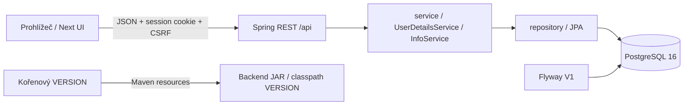

# Architektura technického skeletonu

## Implementováno v etapě 1

Monorepo: `backend/` je Spring Boot 4/Java 17 s původním package `cz.jpmad.springprojecttemplate`; `frontend/` je samostatný Next.js App Router/TypeScript; PostgreSQL 16 ukládá účty. Kořen uchovává VERSION, LICENSE, Compose a týmové materiály. Business logika a autorizace zůstávají ve Springu. Žádný NextAuth, JWT, OAuth, Redis nebo mikroservisy nejsou potřeba.

Zachované vrstvy `api`, `config`, `model`, `repository`, `service` používají constructor injection a DTO records. `User` má UUID, BCrypt passwordHash, roli a auditní časy. Zatím nemá hráčský profil. Veřejná registrace ignoruje jakoukoli dodanou roli a vytváří pouze USER. Enum dále zná ADMIN, COACH, PLAYER, PARENT; klubové přidělování rolí dosud nemá API.

## Session a chyby

API klient používá `withCredentials`. Před každou mutací načte `GET /api/auth/csrf` a jeho token předá v `X-CSRF-TOKEN`. Token je uložen v HTTP session a klient dostává maskovanou hodnotu pro standardní XOR ochranu Spring Security. Přihlášení volá session authentication strategy (změna session ID a zrušení starého CSRF tokenu) a explicitně ukládá security context. Token se proto získává znovu i po přihlášení/odhlášení. Mutace se při chybě neopakují automaticky.

`POST /api/auth/logout` obsluhuje jediný Spring Security logout filter: invaliduje session, smaže kontext i cookie JSESSIONID na cestě /api. Paralelní logout controller, HTTP Basic a remember-me jsou odstraněné; není zaveden limit souběžných sessions. Odpovědi controllerů i security filtrů používají tvar `timestamp`, `code`, `message`, volitelně `details`. 401 znamená nepřihlášeného nebo neplatné údaje; 403 odmítnutou akci nebo CSRF. Frontend rozlišuje anonymní stav a nedostupnost serveru, při selhání logoutu netvrdí úspěšné odhlášení.

Cookie je HttpOnly a SameSite=Lax. Výchozí backend konfigurace je Secure=true, dev profil a lokální Compose Secure=false; HTTPS override nastavuje true. Produkční nasazení má UI a API pod jednou doménou. CORS čte explicitní seznam origins z prostředí, žádná wildcard s credentials; servlet context-path /api není součást controller mappingu ani security matcheru. Veřejné jsou CSRF/login/register, info, dokumentace API a minimální actuator health. `me` vyžaduje session, ostatní Actuator endpointy ADMIN.

## Databáze a verze

V1 vytváří pouze `users` podle skutečné entity. Flyway je aktivní ve vývoji, testech i produkci; baseline-on-migrate není zapnutý a Hibernate ddl-auto=validate. Testy provádějí migraci nad čerstvým PostgreSQL. Dev profil nezakládá žádný default účet. Jediným zdrojem app verze je kořenový VERSION, přibalený do JAR pomocí Maven resources; ruční kopie v backend resources neexistuje. InfoService zachovává renderování Markdownu a `info.cacheTtlMs`.

## Navazující architektura — návrh, dosud neimplementováno

Jednotlivé domény rozšiřují stejné vrstvy. Autorizační pravidla běží v transakčních službách a omezují také dotazy podle týmu a vztahu rodič–hráč. Notifikace mají databázové události/outbox a opakovatelný scheduler; komunikace má vlastní konverzace a zprávy. Výsledky a agregace používají verzovaná pravidla soutěže, statistiky mají administrátorské datové definice. Podrobnosti v domain-model, database-design a authorization.

Frontendová ochrana dashboardu je navigační pomoc; skutečné oprávnění ověřuje server. Doménový ERD není již nasazené schéma a roadmapa není seznam hotových funkcí.
