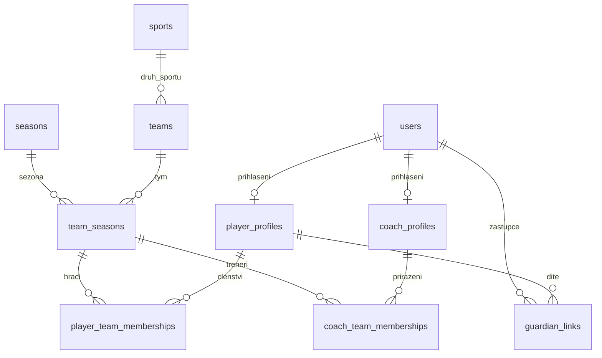
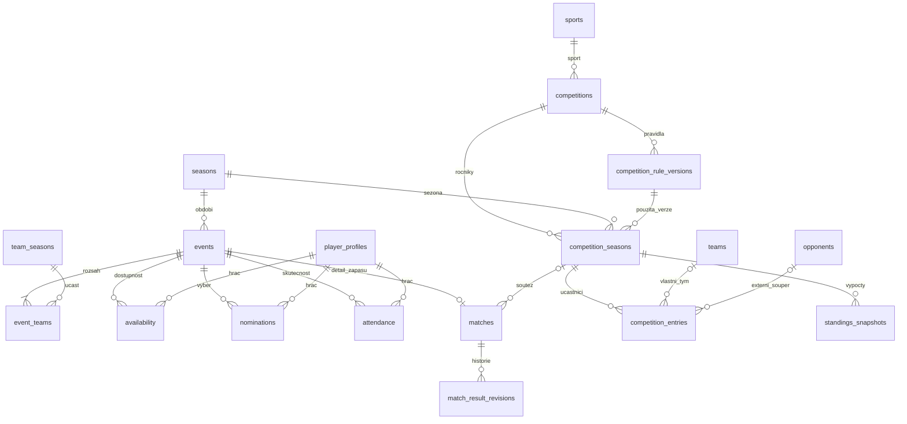
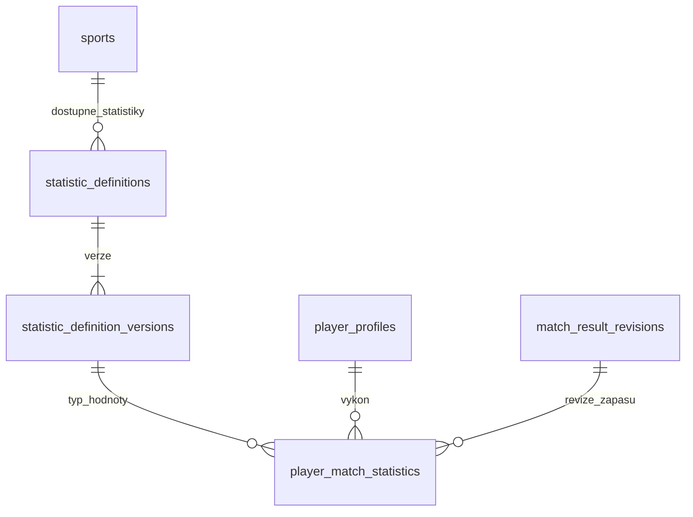
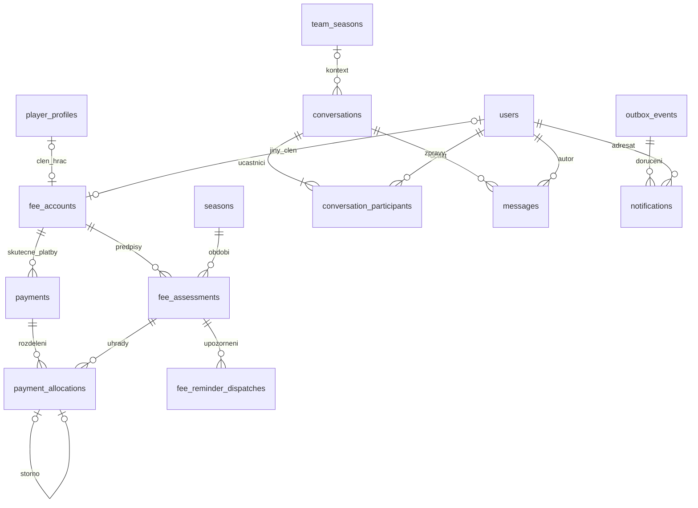

# Návrh databáze

**Stav:** živá databáze skeletonu obsahuje pouze migraci pro existující `users`. Všechny ostatní tabulky, SQL a diagramy v tomto dokumentu jsou návrh navazujících etap. Tento soubor se nespouští jako migrace. Doménové migrace vzniknou v `backend/src/main/resources/db/migration/` až spolu s implementací, testy a review.

PostgreSQL 16 je zdroj pravdy. UUID jsou primární klíče; FK používají `RESTRICT` pro historická doménová data. Datum splatnosti a hranice sezón jsou `date`, okamžiky `timestamptz` v UTC. Peníze jsou `numeric(14,2)` a měna `char(3)`, skóre `integer`, statistická desetinná hodnota `numeric(20,6)`. Žádná částka není `float`. Texty mají limit délky v DB i DTO. Enum hodnoty níže jsou `varchar` s `CHECK`, aby nové sportovní záznamy nevyžadovaly změnu DB enumu.

Pokud není uvedeno jinak, tabulky s vlastním UUID obsahují `created_at timestamptz NOT NULL`, měnitelné entity navíc `updated_at` a `version bigint NOT NULL DEFAULT 0` pro optimistic locking. Všechny zmíněné sloupce jsou `NOT NULL`, kromě položek výslovně označených `?`. Neprovádí se kaskádové mazání historických výsledků při odstranění účtu. Osobní data se podle případného retenčního pravidla anonymizují se zachováním referenční integrity.

## Účty, profily a sportovní členství

| Tabulka | Sloupce | Omezení a indexy |
| --- | --- | --- |
| `users` — implementovaný základ | `id uuid PK`, `username varchar(50)`, `password_hash varchar(100)`, `role varchar(20)`, `created_at`, `updated_at` | Jedinečné `username`; role `ADMIN/USER/COACH/PLAYER/PARENT`. Odpovídá skutečné JPA entitě, nikoli návrhu nové autentizace. |
| `sports` | `id`, `code varchar(40)`, `name varchar(100)`, `active boolean` | `UNIQUE(code)`, kód stabilní; historicky použitý sport lze deaktivovat. |
| `seasons` | `id`, `name varchar(100)`, `starts_on date`, `ends_on date`, `status varchar(20)`, `archived_at?` | `starts_on < ends_on`, konec je výlučný; status `OPEN/ARCHIVED`; jméno jedinečné. |
| `player_profiles` | `id`, `user_id? FK users`, `first_name varchar(100)`, `last_name varchar(100)`, `birth_date date`, `contact_email? varchar(254)`, `contact_phone? varchar(40)`, `active boolean` | `UNIQUE(user_id)` pro nenulový účet. Datum narození ověřuje server proti současnému datu. Index na příjmení. Profil funguje bez účtu. |
| `coach_profiles` | `id`, `user_id? FK users`, `first_name`, `last_name`, `contact_email?`, `contact_phone?`, `active boolean` | `UNIQUE(user_id)` pro nenulový účet; přiřazení účtu vyžaduje roli `COACH` nebo admina. |
| `guardian_links` | `id`, `guardian_user_id FK users`, `player_id FK player_profiles`, `relationship varchar(30)`, `valid_from date`, `valid_to? date`, `verified_at?`, `verified_by? FK users` | `valid_to > valid_from`, druh `PARENT/LEGAL_GUARDIAN`; neověřená vazba nedává přístup. Unikátní nezačínající duplicitní interval; vyloučení překrývajících se intervalů pro stejnou dvojici. Index `(guardian_user_id, player_id)`. |
| `teams` | `id`, `sport_id FK sports`, `name varchar(120)`, `category? varchar(60)`, `active boolean` | `UNIQUE(sport_id, name)`; sport po historickém použití nelze měnit. |
| `team_seasons` | `id`, `team_id FK teams`, `season_id FK seasons`, `display_name varchar(120)` | `UNIQUE(team_id, season_id)`; historický název oddělen od aktuálního názvu týmu. |
| `player_team_memberships` | `id`, `team_season_id FK team_seasons`, `player_id FK player_profiles`, `valid_from date`, `valid_to? date`, `jersey_number? integer`, `position_label? varchar(60)` | Neprolínající se intervaly stejného hráče v témže `team_season`; `jersey_number >= 0`; členství více týmů je možné. Index `(player_id, team_season_id)`. |
| `coach_team_memberships` | `id`, `team_season_id FK team_seasons`, `coach_id FK coach_profiles`, `valid_from date`, `valid_to? date`, `assignment varchar(30)` | `assignment HEAD/ASSISTANT`; neprolínající se intervaly stejné dvojice; oprávnění na tým nikdy nevzniká jen rolí `COACH`. |

Intervaly jsou `[valid_from, valid_to)`, neomezený konec je null. Pro intervalové výluky se v doménové migraci použije rozšíření `btree_gist`. Příslušnost člena se hodnotí podle místního data události v časové zóně klubu. Server kontroluje i hranice sezóny; toto pravidlo porovnává více tabulek a jednoduchý `CHECK` je nevyjádří.



## Události, soutěže a výsledky

| Tabulka | Sloupce | Omezení a indexy |
| --- | --- | --- |
| `events` | `id`, `season_id FK seasons`, `type varchar(20)`, `title varchar(160)`, `description? text`, `starts_at`, `ends_at`, `timezone varchar(60)`, `location? varchar(200)`, `status varchar(20)`, `availability_deadline?`, `created_by FK users` | Typ `TRAINING/MATCH/OTHER`; status `DRAFT/PUBLISHED/CANCELLED/COMPLETED`; `ends_at > starts_at`, uzávěrka nejvýše začátek. Index `(season_id, starts_at)`. |
| `event_teams` | `event_id FK events`, `team_season_id FK team_seasons` | Složené PK; stejná sezóna ověřená service/constraint triggerem. Publikovaná událost musí mít alespoň jeden tým. |
| `availability` | `event_id FK events`, `player_id FK player_profiles`, `status varchar(20)`, `comment? varchar(500)`, `recorded_by FK users`, `updated_at`, `version` | PK `(event_id, player_id)`; `AVAILABLE/UNAVAILABLE/UNKNOWN`. Přístup a historické členství ověřuje server. |
| `nominations` | `event_id`, `player_id`, `team_season_id`, `status varchar(20)`, `published_at?`, `reason? varchar(500)`, `recorded_by`, `updated_at`, `version` | PK `(event_id, player_id)`; `SELECTED/RESERVE/REMOVED`; složený FK `(event_id, team_season_id)` do `event_teams`. Změny mají audit. |
| `attendance` | `event_id`, `player_id`, `team_season_id`, `status varchar(20)`, `minutes? integer`, `comment? varchar(500)`, `recorded_by`, `updated_at`, `version` | PK `(event_id, player_id)`; `PRESENT/ABSENT/EXCUSED/LATE`; `minutes >= 0`; FK do `event_teams`; zápis po začátku. |
| `opponents` | `id`, `sport_id`, `name varchar(160)`, `active boolean` | FK sports; index `(sport_id, name)`; jméno nemusí být jedinečné mezi kluby. |
| `competitions` | `id`, `sport_id`, `name varchar(160)`, `active boolean` | FK sports; `UNIQUE(sport_id, name)`. |
| `competition_rule_versions` | `id`, `competition_id`, `revision integer`, `label varchar(100)`, `allow_draw boolean`, `points jsonb`, `tie_breakers jsonb`, `head_to_head_missing_policy varchar(30)`, `restart_head_to_head_on_subgroup boolean`, `forfeit_home_score integer`, `forfeit_away_score integer`, `created_by` | `UNIQUE(competition_id, revision)`; revize > 0; JSON validovaný proti uzavřenému schématu; politika `REQUIRE_COMPLETE/PLAYED_ONLY`. Po použití neměnné. |
| `competition_seasons` | `id`, `competition_id`, `season_id`, `rule_version_id`, `results_revision bigint DEFAULT 0` | `UNIQUE(competition_id, season_id)`; složený FK `(rule_version_id, competition_id)` brání použití cizích pravidel. |
| `competition_entries` | `id`, `competition_season_id`, `team_id?`, `opponent_id?`, `display_name varchar(160)` | Právě jeden z team/opponent; dvě částečné unique constraints `(competition_season_id, team_id/opponent_id)`; sport se musí shodovat. `UNIQUE(id, competition_season_id)` pro složené FK. |
| `matches` | `id`, `event_id UNIQUE`, `competition_season_id?`, `home_team_id?`, `home_opponent_id?`, `away_team_id?`, `away_opponent_id?`, `home_entry_id?`, `away_entry_id?`, `active_result_revision_id?` | FK events; událost typu MATCH. Na každé straně právě jeden vlastní tým nebo externí soupeř. Různé strany. Soutěžní zápas má oba entry ze stejné soutěže; přátelský zápas žádné. Vlastní tým musí být zařazen do události. |
| `match_result_revisions` | `id`, `match_id`, `revision integer`, `status varchar(20)`, `home_score integer`, `away_score integer`, `decision varchar(30)`, `confirmed_by?`, `confirmed_at?`, `correction_reason? varchar(500)` | `UNIQUE(match_id, revision)`, `UNIQUE(id, match_id)`; skóre >= 0; `DRAFT/CONFIRMED/ANNULLED`; `REGULAR/OVERTIME/FORFEIT_HOME/FORFEIT_AWAY`. Aktivní výsledek ukazuje na revizi stejného zápasu složeným FK. Potvrzené revize jsou neměnné. |
| `standings_snapshots` | `id`, `competition_season_id`, `rule_version_id`, `results_revision`, `computed_at`, `rows jsonb` | `UNIQUE(competition_season_id, rule_version_id, results_revision)`; odvozená cache, nikoli zdroj pravdy. Obsahuje počet zápasů, body, skóre i použitá kritéria. |
| `standing_decisions` | `id`, `competition_season_id`, `rule_version_id`, `results_revision`, `ordered_entry_ids jsonb`, `reason varchar(500)`, `recorded_by` | Ruční rozhodnutí pouze při úplné shodě; kontrola příslušnosti entry a neduplicitního pořadí serverem; změna výsledků rozhodnutí zneplatní. |

`match_result_revisions` nepoužívá záporné skóre jako kód kontumace. Kontumace je explicitní rozhodnutí a přiděluje body dle uložené konfigurace. Body pro basketbal rozlišují běžnou porážku a kontumační porážku. `points` obsahuje úplnou mapu povolených outcome → nezáporné body, například `WIN`, `DRAW`, `LOSS`, `FORFEIT_WIN`, `FORFEIT_LOSS`, volitelně `OVERTIME_WIN/LOSS`; neznámé klíče či chybějící potřebný klíč se odmítnou. JSON pole `tie_breakers` používá pevný číselník operací, nikoli volně spustitelný vzorec.



## Dynamické individuální statistiky

| Tabulka | Sloupce | Omezení a indexy |
| --- | --- | --- |
| `statistic_definitions` | `id`, `sport_id`, `code varchar(60)`, `active boolean` | `UNIQUE(sport_id, code)`; stabilní identita, žádné pevné `goals`/`assists` sloupce. |
| `statistic_definition_versions` | `id`, `definition_id`, `revision integer`, `name varchar(120)`, `value_type varchar(20)`, `unit? varchar(40)`, `aggregation varchar(20)`, `min_value? numeric(20,6)`, `max_value? numeric(20,6)`, `decimal_scale? smallint`, `text_max_length? integer`, `allowed_values? jsonb`, `created_by` | `UNIQUE(definition_id, revision)`; typ `INTEGER/DECIMAL/BOOLEAN/TEXT`; kompatibilní agregace dle [modelu](domain-model.md); min <= max; scale 0..6; text limit 1..2000. Použitá verze neměnná. |
| `player_match_statistics` | `id`, `result_revision_id`, `player_id`, `definition_version_id`, `integer_value? bigint`, `decimal_value? numeric(20,6)`, `boolean_value? boolean`, `text_value? varchar(2000)`, `recorded_by` | `UNIQUE(result_revision_id, player_id, definition_version_id)`; právě jeden hodnotový sloupec vyplněn. FK výsledek/hráč/verze. Index `(player_id, definition_version_id)`. |

DB zaručuje právě jeden vyplněný hodnotový sloupec. Service a constraint trigger ověří jeho typ proti verzi definice, min/max, škálu, délku/číselník, sport zápasu a příslušnost hráče k účastníkům a docházce. V celé revizi výsledku smí mít hráč nejvýše jednu hodnotu **identity** definice, i kdyby byly zadány dvě její verze; tuto kontrolu zajistí transakční service/trigger. Hodnoty mohou vzniknout v návrhu výsledku, do oficiálních součtů vstupují až s potvrzením. Typ/jednotka/agregace se nedají změnit pod historickými hodnotami. Chybějící hodnota je chybějící řádek, nikoli nula.



## Finance, komunikace, notifikace a audit

| Tabulka | Sloupce | Omezení a indexy |
| --- | --- | --- |
| `fee_accounts` | `id`, `player_id?`, `member_user_id?`, `active boolean` | Právě jeden držitel; každý hráč/účet má nejvýše jeden účet příspěvků; `UNIQUE(player_id)`, `UNIQUE(member_user_id)`. Zástupce není zaměněn za člena, na kterého je předpis vystaven. |
| `fee_assessments` | `id`, `fee_account_id`, `season_id`, `title varchar(160)`, `amount numeric(14,2)`, `currency char(3)`, `due_on date`, `due_revision integer DEFAULT 1`, `cancelled_at?`, `cancel_reason?`, `created_by` | `amount > 0`; index `(due_on, fee_account_id)`; měna ze spravovaného číselníku. Po přidělené platbě změna částky vyžaduje opravný postup; nelze zrušit uhrazený předpis bez storna alokací. |
| `payments` | `id`, `fee_account_id`, `amount`, `currency`, `paid_at`, `method varchar(20)`, `reference? varchar(160)`, `recorded_by`, `reversed_at?`, `reversal_reason?` | `amount > 0`; `BANK/CASH/OTHER`; reference není automatický důkaz úhrady; index `(fee_account_id, paid_at)`. Záznam skutečné platby výhradně adminem. |
| `payment_allocations` | `id`, `payment_id`, `fee_assessment_id`, `amount numeric(14,2)`, `reversal_of? UNIQUE FK payment_allocations`, `reason? varchar(500)`, `recorded_by` | Běžná amount > 0; storno amount < 0 a reversal_of povinné; žádné řetězené storno; stejný člen/měna; storno je přesný opak původního záznamu. Suma čistých alokací nepřesáhne platbu ani předpis. |
| `conversations` | `id`, `team_season_id?`, `kind varchar(20)`, `title? varchar(160)`, `created_by`, `closed_at?` | `DIRECT/TEAM`; týmový druh vyžaduje team_season_id. |
| `conversation_participants` | `conversation_id`, `user_id`, `joined_at`, `left_at?`, `last_read_message_id?` | PK `(conversation_id, user_id)`; `left_at >= joined_at`; FK last_read musí být zpráva téže konverzace. Členství vychází z oprávnění, ne z role samotné. |
| `messages` | `id`, `conversation_id`, `author_id`, `body varchar(5000)`, `sent_at`, `hidden_at?` | Složený FK `(conversation_id, author_id)` do participants; autor musí být účastníkem i v době odeslání; neměnný text bez HTML a bez prázdných hodnot. Index `(conversation_id, sent_at, id)`. Obecný admin audit neobsahuje obsah soukromé zprávy. |
| `outbox_events` | `id`, `event_key varchar(200) UNIQUE`, `type varchar(60)`, `aggregate_type varchar(60)`, `aggregate_id uuid`, `aggregate_revision bigint`, `payload jsonb`, `occurred_at`, `processed_at?`, `attempt_count integer`, `next_attempt_at?` | Transakční zápis s doménou; index nezpracovaných záznamů; payload neobsahuje tajné hodnoty. Worker používá `FOR UPDATE SKIP LOCKED`. |
| `notifications` | `id`, `recipient_id FK users`, `outbox_event_id`, `type`, `title varchar(160)`, `body varchar(2000)`, `target_type?`, `target_id?`, `read_at?` | `UNIQUE(outbox_event_id, recipient_id)` pro opakované doručení; index `(recipient_id, read_at, created_at)`; target je ověřen serverem při otevření. |
| `fee_reminder_dispatches` | `fee_assessment_id`, `due_revision`, `reminder_kind`, `recipient_id`, `outbox_event_id`, `dispatched_at` | PK `(fee_assessment_id, due_revision, reminder_kind, recipient_id)`; druh `DUE_SOON/OVERDUE`; člen i každý příslušný admin mají vlastní marker. Předstih je spravované klubové nastavení. |
| `club_settings` | `key varchar(80) PK`, `value jsonb`, `updated_by`, `updated_at`, `version` | Uzavřený číselník klíčů a serverové schéma: časová zóna, předstih splatnosti a režim upozornění. Žádné libovolné spouštěné skripty. |
| `audit_entries` | `id`, `actor_user_id?`, `action varchar(80)`, `entity_type`, `entity_id uuid`, `revision? bigint`, `reason? varchar(500)`, `changes jsonb`, `occurred_at` | Append-only; index `(entity_type, entity_id, occurred_at)`; výběr polí do diffu vyřazuje hesla/tokeny a nadbytečné osobní údaje. |

Zůstatek předpisu je `amount - SUM(payment_allocations.amount)` pro nezrušený předpis. Stav se odvodí ze zůstatku, nikoli ručně udržovaným booleanem. Nealokovaná část platby je kredit. Storno celé platby v jedné transakci vytvoří opačné alokace, zapíše `reversed_at` a důvod; není to fyzické odstranění. Při všech alokacích se zamyká platba a cílové předpisy ve stabilním pořadí UUID, kontrolují se jejich aktuální zůstatky a revize. Současné požadavky nemohou oba přidělit stejný dostupný zůstatek. Idempotency key admin příkazu zabrání dvojímu záznamu při opakování HTTP požadavku.



## Ilustrační SQL pro budoucí migrace

Následující SQL demonstruje klíčové constrainty; **není úplná ani spuštěná migrace**. Chybějící tabulky z přehledů a constraint triggery vzniknou etapově při implementaci. Skutečný první Flyway soubor nesmí zahrnovat toto návrhové schéma.

```sql
-- NÁVRH, NESPUSŤTĚNO: vyžaduje existující users a doménové referenční tabulky.
CREATE EXTENSION IF NOT EXISTS btree_gist;

CREATE TABLE sports (
    id uuid PRIMARY KEY,
    code varchar(40) NOT NULL UNIQUE,
    name varchar(100) NOT NULL,
    active boolean NOT NULL DEFAULT true,
    created_at timestamptz NOT NULL DEFAULT now()
);

CREATE TABLE player_team_memberships (
    id uuid PRIMARY KEY,
    team_season_id uuid NOT NULL REFERENCES team_seasons(id),
    player_id uuid NOT NULL REFERENCES player_profiles(id),
    valid_from date NOT NULL,
    valid_to date,
    jersey_number integer CHECK (jersey_number >= 0),
    position_label varchar(60),
    created_at timestamptz NOT NULL DEFAULT now(),
    updated_at timestamptz NOT NULL DEFAULT now(),
    version bigint NOT NULL DEFAULT 0,
    CHECK (valid_to IS NULL OR valid_to > valid_from),
    EXCLUDE USING gist (
        team_season_id WITH =,
        player_id WITH =,
        daterange(valid_from, valid_to, '[)') WITH &&
    )
);

CREATE TABLE player_match_statistics (
    id uuid PRIMARY KEY,
    result_revision_id uuid NOT NULL REFERENCES match_result_revisions(id),
    player_id uuid NOT NULL REFERENCES player_profiles(id),
    definition_version_id uuid NOT NULL REFERENCES statistic_definition_versions(id),
    integer_value bigint,
    decimal_value numeric(20,6),
    boolean_value boolean,
    text_value varchar(2000),
    recorded_by uuid NOT NULL REFERENCES users(id),
    created_at timestamptz NOT NULL DEFAULT now(),
    UNIQUE (result_revision_id, player_id, definition_version_id),
    CHECK (num_nonnulls(integer_value, decimal_value, boolean_value, text_value) = 1)
);

CREATE TABLE payment_allocations (
    id uuid PRIMARY KEY,
    payment_id uuid NOT NULL REFERENCES payments(id),
    fee_assessment_id uuid NOT NULL REFERENCES fee_assessments(id),
    amount numeric(14,2) NOT NULL,
    reversal_of uuid UNIQUE REFERENCES payment_allocations(id),
    reason varchar(500),
    recorded_by uuid NOT NULL REFERENCES users(id),
    created_at timestamptz NOT NULL DEFAULT now(),
    CHECK (
        (amount > 0 AND reversal_of IS NULL)
        OR (amount < 0 AND reversal_of IS NOT NULL AND reason IS NOT NULL)
    )
);

-- Výběr zdroje tabulky: žádný návrh nebo stará nahrazená revize.
SELECT r.*
FROM matches m
JOIN match_result_revisions r
  ON r.id = m.active_result_revision_id AND r.match_id = m.id
WHERE m.competition_season_id = :competition_season_id
  AND r.status = 'CONFIRMED';

-- Zůstatek předpisu se vždy počítá ze skutečné alokace a jejího storna.
SELECT f.id, f.amount - COALESCE(SUM(a.amount), 0) AS outstanding
FROM fee_assessments f
LEFT JOIN payment_allocations a ON a.fee_assessment_id = f.id
WHERE f.cancelled_at IS NULL
GROUP BY f.id, f.amount;
```

## Hranice validace a transakcí

DB kontroluje PK/FK, jedinečnost, jednoduché rozsahy, XOR, neprolínající se intervaly a při doménových migracích také cross-table invarianty constraint triggery. Service v jedné transakci kontroluje role, aktuální vazby, dostupnost, stav sezóny, příslušnost sportu a změny výsledků. Role účtu nikdy nenahrazuje FK členství. Pouhá frontendová validace není dostačující.

Potvrzení/oprava výsledku zamkne zápas a soutěžní sezónu, uloží novou neměnnou revizi, propojí její statistiky, změní aktivní revizi, zvýší `results_revision` a zapíše outbox+audit. Výpočet tabulky používá jednu konzistentní revizi výsledků. Potvrzení definice/pravidel zkontroluje kompatibilitu s historickými daty. Scheduler splatností zakládá deduplikační marker a outbox v jedné transakci. Notifikace se čtou pouze pro `recipient_id` aktuálního účtu.

Migrace se nejprve testují nad prázdným PostgreSQL Testcontainerem a pak nad databází předchozího release. `ddl-auto=validate` zůstává ve vývoji, testech i produkci. Nesmí se přidávat `ddl-auto=update` ani automatický baseline, který zakryje chybějící migrace. Produkční seed neobsahuje žádná známá výchozí hesla; demonstrační kluby, sporty a účty patří jen do explicitního vývojového/testovacího profilu.
